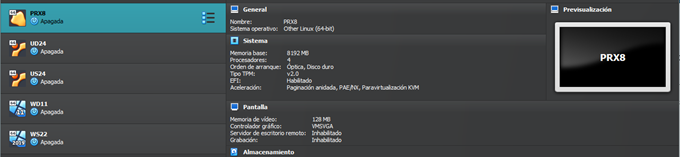
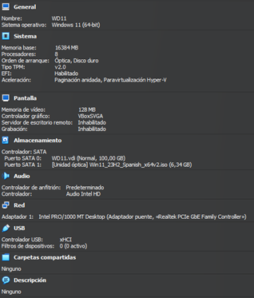
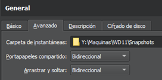
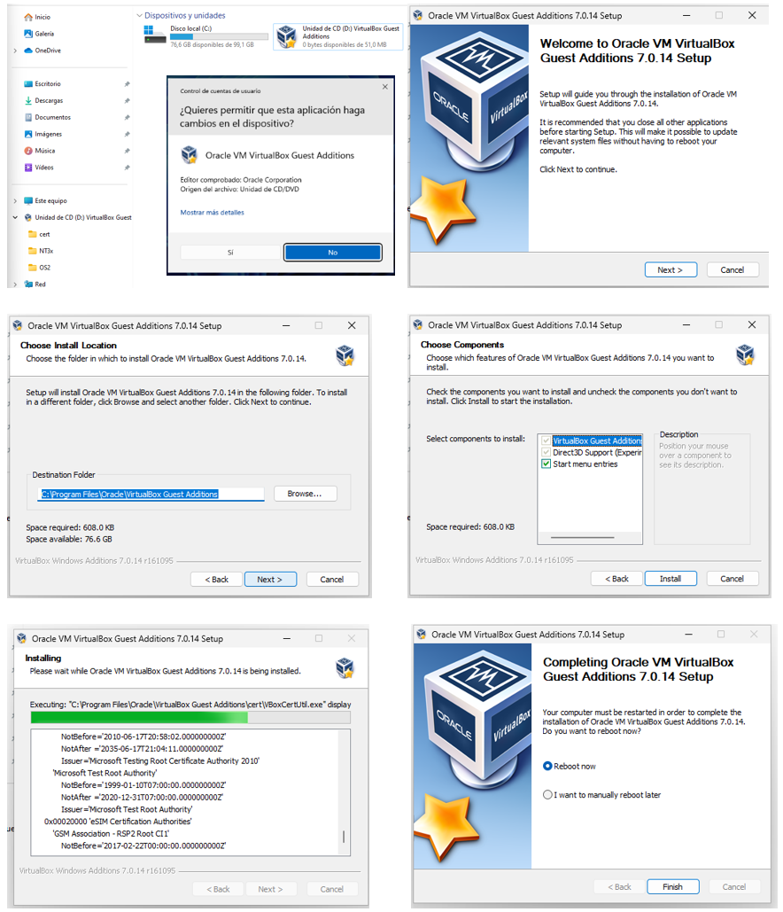

# **💠 Configuraciones básicas**

- [**💠 Configuraciones básicas**](#-configuraciones-básicas)
  - [**🛠️Configuraciones Hardware**](#️configuraciones-hardware)
  - [**Configuraciones Software**](#configuraciones-software)
    - [**Configuraciones básicas en Windows**](#configuraciones-básicas-en-windows)
      - [Paso 1 Actualizar sistemas](#paso-1-actualizar-sistemas)
    - [Paso 2 Actualizar Guest Additions](#paso-2-actualizar-guest-additions)
    - [Paso 3: Prompt en color](#paso-3-prompt-en-color)
    - [Paso 4: Alias y atajos](#paso-4-alias-y-atajos)
  - [Configuraciones básicas en Linux](#configuraciones-básicas-en-linux)
    - [Paso 1 Actualizar sistemas](#paso-1-actualizar-sistemas-1)
    - [Paso 2 Actualizar Guest Additions](#paso-2-actualizar-guest-additions-1)
    - [Paso 3: Prompt en color](#paso-3-prompt-en-color-1)
    - [Paso 4: Alias y atajos](#paso-4-alias-y-atajos-1)
    - [Paso 5: Color de los directorios](#paso-5-color-de-los-directorios)
  - [Dificultades encontradas](#dificultades-encontradas)
    - [Usuario en Windows 11](#usuario-en-windows-11)
    - [Pantallazo negro en Ubuntu](#pantallazo-negro-en-ubuntu)

Durante el curso se van a trabajar con diferentes máquinas virtuales estas deben tener las configuraciones básicas solicitadas y realizar una ova de las mismas despues de configurarlas, para cada supuesto se harán clonaciones y se trabajará sobre estas. 

    Los sistemas operativos principales son:
      ws22 - Windows Server 2022
      wd11 - Windows 11
      us24 - Ubuntu Server 24.04
      ud24 - Ubuntu 24.04 
      px90 - Proxmox 9.0

## **🛠️Configuraciones Hardware**

Las configuraciones de las máquinas dependen de los recursos que tenga el equipo real, pero para un correcto funcionamiento y evitar problema se solicitan los siguientes requisitos mínimos:

-  Sistemas de 64-bit
-  4GB = 4096MB de memoria RAM
-  4 procesadores
-  TPM para Windows
-  Sistema EFI activado en todos.
-  100GB de disco duro
-  Habilitar en General → Avanzado el portapapeles y el arrastrar y soltar.
-  

## **Configuraciones Software**

Una vez tengamos las configuraciones hardware realizadas pasaremos a descargarnos las imágenes iso, de los diferentes sistemas operativos, las agregamos a la unidad óptica e iniciamos la máquina virtual siguiendo el asistente de instalación. En este apartado es importante poner como nombre de usuario el nombre de alumnado, y como nombre de equipo la clave del sistema operatico y el nombre del alumnado.

### **Configuraciones básicas en Windows**

Las configuraciones básicas se basan en hacer los siguientes pasos en todas las máquinas, como ejemplo se van a realizar las mismas para un sistema operativo Windows 11:

#### Paso 1 Actualizar sistemas

Para actualizar el sistema iremos a la pestaña de configuración y en la sección de Windows Update buscaremos y actualizaremos el sistema hasta la última versión disponible:

Una vez actualizado comprobaremos que nuestra versión obtenida con las teclas win + R y escribiendo winver en la pestaña de ejecutar coincide con la última del historial de versiones de nuestro sistemas el cual lo obtendremos de la información de la siguiente web oficial: https://learn.microsoft.com/es-es/windows/release-health/

### Paso 2 Actualizar Guest Additions

Para la instalación de las Guestt Additions en todos los sistemas el primer paso es insertar imagen de CD de los complementos del invitado…

Nos vamos a la unidad de CD desde el sistema operativo y ejecutamos el programa y seguimos los pasos del asistente de instalación:

### Paso 3: Prompt en color

Para cambiar el color del prompt en PowerShell tenemos que hacer un pequeño script, para ello abrimos el PowerShell ISE, y creamos el siguiente archivo:
IMPORTANTE: Hay que respetar el nombre del archivo al igual que el código cualquier carácter incorrecto podría significar el no funcionamiento del mismo:

A continuación, pasamos a guardar el archivo con el nombre indicado que se muestra en la pestaña de la imagen anterior, en el directorio C:\Users\user1\Documents\WindowsPowerShell si alguna de estas carpetas no existe como por ejemplo WindowsPowerShell pues las crearemos manualmente. Recordar que user1 es el nombre de vuestro usuario en el sistema:

A continuación, vamos a Powershell como administrador y cambiamos las políticas de ejecución en la máquina para que nos permita ejecutar el script: Set-ExecutionPolicy Unrestricted

y al reiniciar PowerShell ya estaría todo correcto:

### Paso 4: Alias y atajos

Para la creación del atajo de teclas iremos a la ruta del ejecutable de PowerShell “C:\Users\yeray\AppData\Roaming\Microsoft\Windows\StartMenu\Programs\Windows PowerShell”

Una vez en el directorio vamos a las propiedades del archivo, pestaña Acceso directo y tecla de método abreviado y pulsamos las teclas que queremos que pasen hacer los atajos para abrir dicho programa:

Como podemos ver en la segunda imagen se ha configurado para que el programa se ejecute como administrador ya que será el que frecuentemente usemos.

## Configuraciones básicas en Linux

Los siguientes 5 pasos de configuraciones básicas se han de hacer en todas las máquinas base de Linux en este caso se muestra un ejemplo en Ubuntu server al no tener interfaz gráfica y ser la que presenta mayores dificultades.

### Paso 1 Actualizar sistemas

Para actualizar los equipos de Ubuntu debemos de ejecutar el siguiente comando en modo superusuario: “sudo apt update && apt upgrade -y” a veces la propia terminal nos solicitara algunos comandos más en sus mensajes, deberemos realizarlo hasta que al final de la captura se muestran cuatro 0 que indican que no faltan paquetes por actualizar ni instalar.

### Paso 2 Actualizar Guest Additions

Para la instalación de las Guestt Additions en todos los sistemas el primer paso es insertar imagen de CD de los complementos del invitado…

A continuación, creamos una carpeta (guest) montamos los directorios del CD y comprobamos su contenido, en él nos encontramos varios programas ejecutables usamos el comando sh para ejecutar las Guestt Additions de Linux y se instalen:

Nos saldrá un error porque necesitamos el paquete bzip2 para poder descomprimir el contenido de las Guest Additions, lo instalamos y después ejecutamos el script:

### Paso 3: Prompt en color

Para cambiar el prompt de color debemos de hacer las siguientes instrucciones por cada usuario del sistema, en este manual se hará solo para el usuario administrador del root:

1. Iniciamos sesión en el usuario y vamos a su directorio personal con el comando cd, a continuación, modificamos el archivo oculto. bashrc con el siguiente comando: nano .bashrc

2. Debemos hacer dos cambios:
   2.1. Eliminar el comentario, es decir eliminar el # que aparece delante de la línea force_color_prompt=yes
   2.2. Cambiar el valor de la variable PS1 que tendrá que cambiarse por lo siguiente: PS1='${debian_chroot:+($debian_chroot)}\[\033[01;32m\]\u@\h\[\033[00m\]:\[\033[01;36m\]\w\[\033[00m\]\$ '
   Obteniendo como resultado:

3. Comprobamos iniciando sesión en los usuario y mostrando que sale el prompt en los colores configurados:

### Paso 4: Alias y atajos

En este paso crearemos un alias que nos va a facilitar el trabajo durante el resto del curso y será el alias de act, para ello en el archivo anterior recordar que esto hay que hacerlo en cada uno de los usuarios del sistema, debemos añadir una línea por cada alias. Una vez abierto el archivo con nano podemos editar, buscamos la sección de los alias y añadimos la última línea que se muestra en la imagen:

### Paso 5: Color de los directorios

En Linux cuando listamos los diferentes elementos tienes una serie de colores predeterminados que vienen preconfigurados en la variable $LS_COLORS en esta sección lo que haremos será cambiar el código de los directorios ya que el azul como se muestra en la captura es un color con dificultades de legibilidad en fondo negro.

Los siguientes apartados se deben de hacer para cada usuario:

1. Crear el archivo oculto .dircolors formateado.

2. Editar archivo con el nano y buscar donde esta el color de los directorios (variable dir) y cambiar de 34(azul) a 32(Verde) como se muestra en la captura.

3. Reiniciamos la sesión del usuario y comprobamos los cambios:

## Dificultades encontradas

### Usuario en Windows 11

En la configuración de Windows 11 nos solicita un correo electrónico para saltarnos este paso deberemos de mostrar la consola con SHIFT + F10 y escribir el comando que se muestra en captura para reiniciar el proceso de instalación sin pedirte cuenta de correo.

### Pantallazo negro en Ubuntu

1. En primer lugar, mirar la comprobación hardware de la máquina y comprobar el tipo de chipset:

2. En caso de que siga sin funcionar pasamos al método número dos que consiste en seguir las instrucciones del siguiente video: https://youtu.be/LKIJFn6cqVE
   Problemas con la tortuga.
   Si las máquinas van muy lentas deberemos de comprobar si tenemos el error de la tortuga y solucionarlo a través del siguiente video. https://youtu.be/6FUJJN4K-2o

[def]: #1--conceptos-básicos-de-git