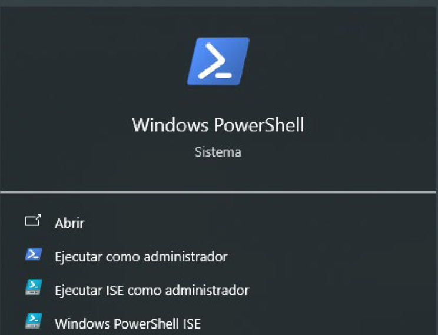
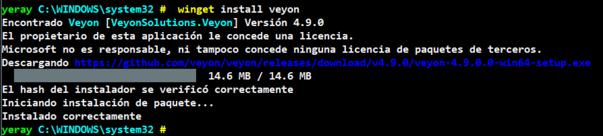
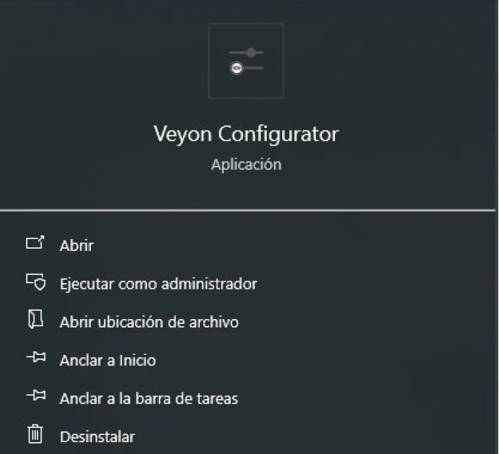
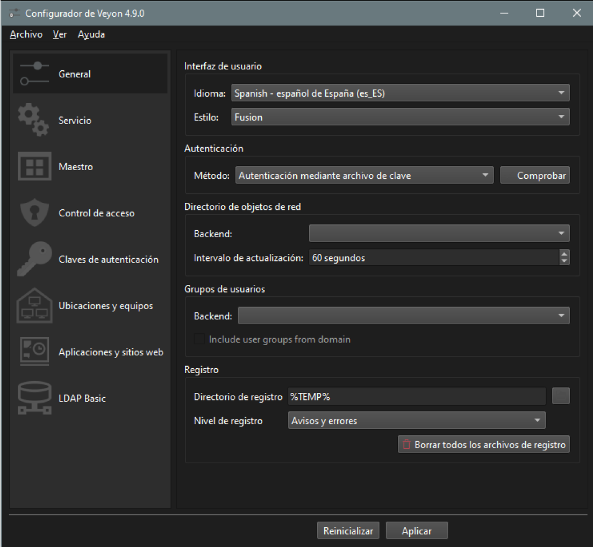
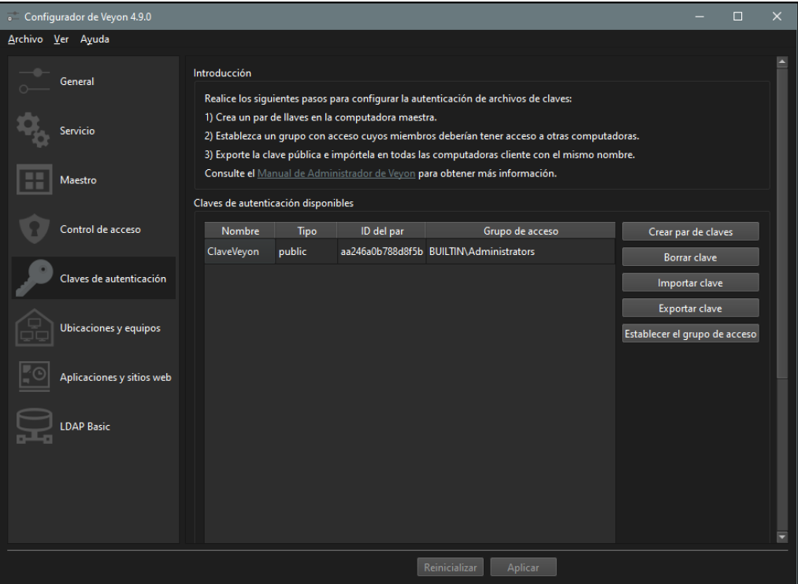
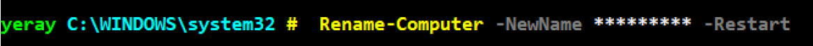
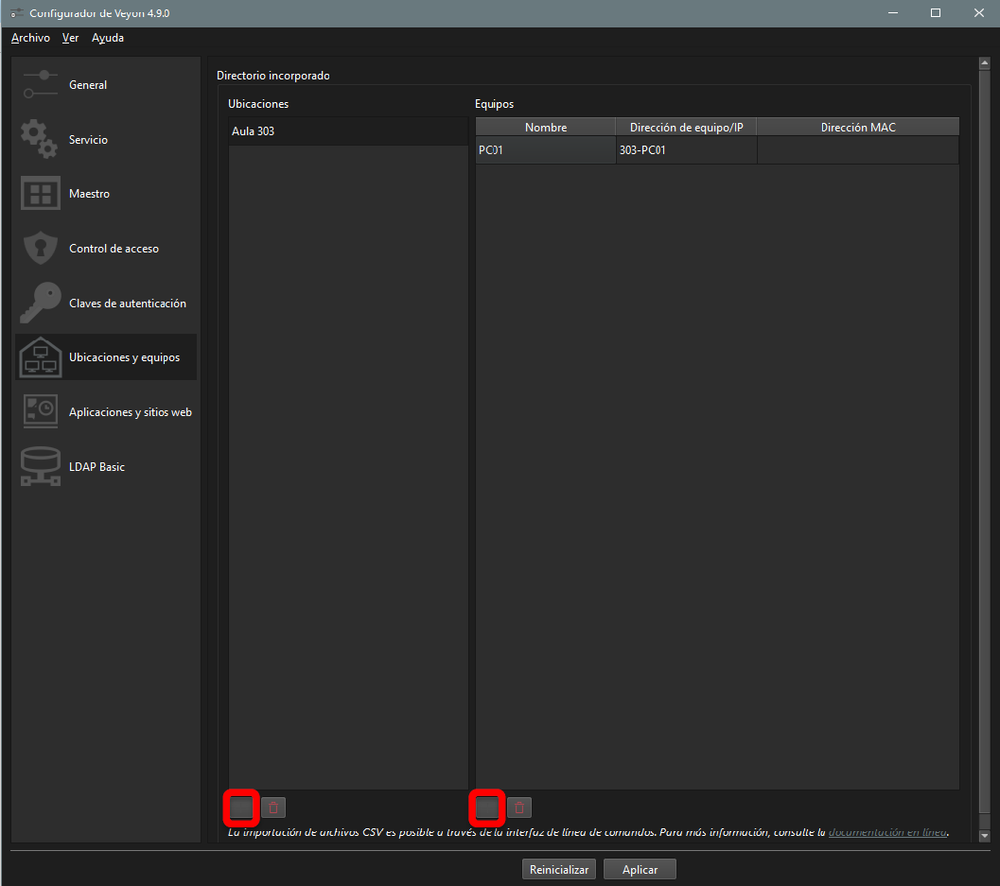

# Manual de instalación del Veyon

- [Manual de instalación del Veyon](#manual-de-instalación-del-veyon)
  - [☑️  Instalación de Veyon](#️--instalación-de-veyon)
    - [¿Qué hacer si winget no instala Veyon?](#qué-hacer-si-winget-no-instala-veyon)
  - [☑️  Configuración del Veyon alumnado](#️--configuración-del-veyon-alumnado)
    - [Paso 1 Pestaña General](#paso-1-pestaña-general)
    - [Paso 2 Pestaña Claves de autentificación](#paso-2-pestaña-claves-de-autentificación)
    - [Cambiar nombre al equipo](#cambiar-nombre-al-equipo)
  - [Configuración del Veyon profesorado](#configuración-del-veyon-profesorado)
    - [Crear grupo y añadir portátiles](#crear-grupo-y-añadir-portátiles)

 
## ☑️  Instalación de Veyon
Veyon es una herramienta de software libre que permite la supervisión y el control de estaciones de trabajo en redes locales, ideal para entornos educativos. A continuación, te guiaré para instalar Veyon utilizando el gestor de paquetes Winget en Windows.
>Podemos hacerlo más rápido desde terminal abrimos el PowerShell en modo administrador y usamoes el gestor de paquetes winget. Si no tienes Winget instalado, sigue las instrucciones de Microsoft (https://learn.microsoft.com/es-es/windows/package-manager/winget/) o asegúrate de tener una versión de Windows 10/11 actualizada. A continuación, instalamos Veyon con el comando que se muestra en la captura

|  |  |
|---|---|
|  |   | 

### ¿Qué hacer si winget no instala Veyon?
En algunos casos, la instalación a través de winget puede no funcionar debido a que no encuentra la última versión disponible o el paquete no está actualizado. Si esto ocurre tendrás que descargarlo desde la web oficial: https://veyon.io/en/. Descarga la última versión estable del instalador manualmente para Windows. Sigue las instrucciones de instalación que aparecen durante el proceso de configuración para completar la instalación de manera manual.
 
## ☑️  Configuración del Veyon alumnado

|  |  |
|---|---|
|  | Para la confivuración del Veyon se debe buscar la aplicación Veyon Configurator y seguir los siguientes pasos: | 
 
### Paso 1 Pestaña General
Cambiar el idioma de la interfaz de usuario a español y en la sección de Autentificación ponemos como método “Autentificación mediante archivo de clave” por último solo nos queda aplicar al final de la ventana y aceptar el reinicio para que se apliquen los cambios.

### Paso 2 Pestaña Claves de autentificación
Descargar la clave pública de este mismo repositorio y agregarla en la sección de claves de autentificación.
 - Hay que descargarla en documentos si la pones en el escritorio podría no funcionar.
 - Cuando la agregas no cambiar el nombre, seguir con los valores por defecto
  
 

:one:

### Cambiar nombre al equipo
Para ello usamos el siguiente comando:
 
Hay que cambiar los asteriscos por el nuevo nombre del equipo la sintaxis Aula-PC00, ejemplo 301-PC01, R03-PC01…una vez sejecutado el comando se reiniciara el equipo con el nuevo nombre.

 
## Configuración del Veyon profesorado
Seguimos los mismos pasos que el alumnado, pero en vez de añadir la clave pública, añadimos solo la clave privada que se encuentra en la siguiente ruta: 
 
### Crear grupo y añadir portátiles
Para ello hay que abrir la el veyon configurator y en la sección de ubicaciones creamos los grupos (aula, ASIR1, ASIR2...) y vamos añadiendo los equipos con añadir el nombre del equipo en la segunda columna es suficiente, en caso de tener alumno con portátiles hay que poner aquí el nombre del portátil del alumno:
(No se obliga en ningún momento a instalarlo en los equipos personales, para todo ello están los equipos de clase en caso de querer hacer el examen en sus propios equipos se ha de instalar este aplicativo)
 

